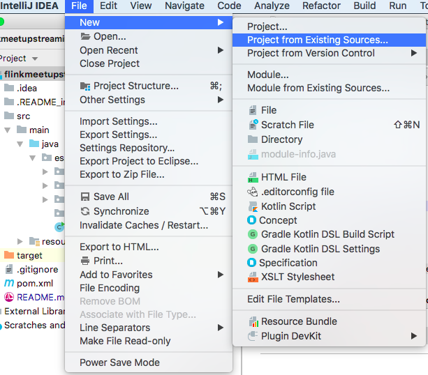
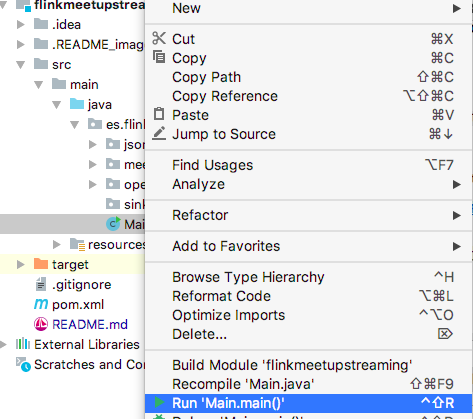
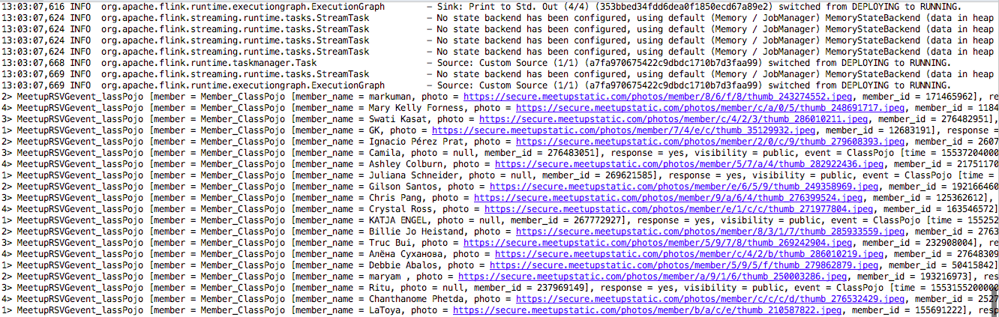

# PROCESSING MEETUP REAL-TIME DATA WITH APACHE FLINK


## 1. Clone the repository

```
git clone -b training --single-branch https://github.com/rubencasado/meetup.git
```

## 2. Import the project in your IDE
Import as MAVEN project using the ```pom.xml``` file you have cloned



## 3. Run the project in your IDE
```Main.java``` is the entry point for the project. You should see in your IDE terminal real-time events




## 4. Use DataStream API

Do the next actions:

1. Delete *bad events* (any of its fields is null) 
2. Count users confirmed for each event each 10 seconds
3. Count users confirmed for each event in the last 20 seconds updating the result each 5 seconds
4. Calculate the Trending Topics (hot words after deleting stop words) based on the topic_name. Analyze the last 60 seconds information and update the results each 10 seconds
5. Calculate in real-time the number of confirmed user for country taking into account all-time data

## 4. Use the SQL Stream API
Try to response the 2 and 3 of the above questions using the SQL API


